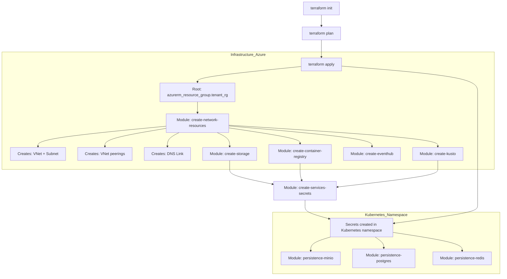
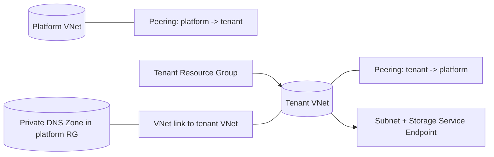

## Terraform ARM v3 Azure Tenant

[](https://www.terraform.io/)
[](https://developer.hashicorp.com/terraform/language/settings/backends/azurerm)
[](https://registry.terraform.io/providers/hashicorp/azurerm/latest)
[](https://registry.terraform.io/providers/hashicorp/azuread/latest)
[](https://registry.terraform.io/providers/hashicorp/kubernetes/latest)
[](https://registry.terraform.io/providers/alekc/kubectl/latest)
[](https://registry.terraform.io/providers/hashicorp/http/latest)
[](https://registry.terraform.io/providers/hashicorp/random/latest)
[](LICENSE)

This `terraform-arm-azure-tenant` module helps you set up Azure resources for a Cosmo Tech tenant. It creates:

- A tenant Azure Resource Group.
- Networking that connects the tenant to an existing platform Virtual Network (with peering and DNS link).
- Optional Azure services: Storage Account, Container Registry (ACR), Event Hub, and Kusto.
- A Kubernetes namespace in your AKS cluster.
- Persistent Volumes for MinIO, Postgres, and Redis.
- Kubernetes secrets for platform services.

The repository includes a main Terraform configuration and several local modules to deploy all required tenant infrastructure on Azure.

## Diagrams

### Deployment workflow (high-level)



### Network module architecture



## Features

- AzureRM backend initialization helper script (Azure Storage backend).
- Explicit modular breakdown per Azure component:
  - Network resources + VNet peering
  - Storage account
  - Azure Container Registry (ACR)
  - Azure Event Hub
  - Azure Data Explorer (Kusto / ADX)
  - Service secrets creation (Kubernetes secrets)
  - Persistent volumes for MinIO / Postgres / Redis

## Tech Stack

- **Terraform** `>= 1.3.9`
- **Providers** (pinned in `providers.tf`)
  - `hashicorp/azurerm` `4.19.0`
  - `hashicorp/azuread` `3.1.0`
  - `hashicorp/kubernetes` `2.35.1`
  - `alekc/kubectl` `2.1.3`
  - `hashicorp/http` `3.4.5`
- **Shell scripts** (`bash` / `sh`) for init/plan/apply and output export
- **Azure CLI** (`az`) required by `_run-init.sh`

## Installation

### Prerequisites

- Terraform `>= 1.3.9`
- Azure CLI (`az`)
- Access to an Azure subscription + permissions to create resources
- A kubeconfig context matching the AKS cluster name
  - `providers.tf` uses `~/.kube/config` and `config_context = var.cluster_name`

### Clone

```bash
git clone <this-repo-url>
cd terraform-arm-azure-tenant
```

## Usage

### Typical workflow (plan/apply)

1. Create or edit your variable file (`terraform.tfvars` or another `*.tfvars`).
2. Initialize the backend.
3. Plan and apply.

This repo provides scripts that encode that flow:

```bash
./_run-init.sh <state_key>
./_run-plan.sh <var-file>
./_run-apply.sh
```
Or, simply run the `_run-terraform.sh` script to execute all three steps (init, plan, apply) in sequence. The script will stop if any step fails.

```bash
./_run-terraform.sh
```

### Providers

Providers are pinned in `providers.tf`. The Kubernetes provider uses:

- `config_path = "~/.kube/config"`
- `config_context = var.cluster_name`

So `cluster_name` must match a kubeconfig context.

## License

See `LICENSE`.


Made with :heart: by Cosmo Tech DevOps team